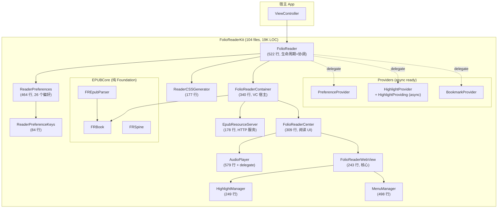

# FolioReaderKit 重构计划（P3 验收 + 下一步）

---

## 全阶段完成状态

### P0 ✅ | P1 ✅ | P2 ✅ | P3 ✅

| 阶段 | 任务数 | 完成 | 核心成果 |
|:---|:---|:---|:---|
| **P0** 安全基础 | 4 | 4/4 | 消除全局副作用，修复递归 bug，建立 17 个测试文件 |
| **P1** 核心解耦 | 5 | 5/5 | God Object 拆分，WebServer/WebView 剥离，偏好常量化 |
| **P2** 代码卫生 | 11 | 11/11 | IUO 89→35，Extensions 536→79 行，UIMenuController 迁移，async Provider |
| **P3** 收尾清理 | 8 | 8/8 | IUO 35→3，delay() 移除，Center 422→309 行 |

---

## P3 验收详情

| 编号 | 任务 | 目标 | 实际 | 状态 |
|:---|:---|:---|:---|:---|
| P3-1 | EPUBCore IUO 清理 | 13→0 | **0**（全部 10 文件无 IUO） | ✅ |
| P3-2 | Page IUO 清理 | 3→0 | **0** | ✅ |
| P3-3 | ScrollScrubber IUO 清理 | 4→0 | **0** | ✅ |
| P3-4 | Container IUO | 保留或改 Optional | 已改为 `Optional?` | ✅ |
| P3-5 | QuoteImage IUO 清理 | 4→0 | **0**（改为 non-optional + init） | ✅ |
| P3-6 | PageIndicator IUO 清理 | 3→0 | **0**（改为 `= UILabel(frame: .zero)`） | ✅ |
| P3-7 | `delay()` 彻底移除 | 0 调用 | **0**（函数已删除） | ✅ |
| P3-8 | Center 继续瘦身 | ≤350 行 | **309 行** | ✅ |

### 残留 IUO（3 处，全部不可避免）

| 文件 | 字段 | 原因 |
|:---|:---|:---|
| `FolioReaderCenter.swift:29` | `collectionView: UICollectionView!` | UIKit `viewDidLoad` 初始化模式 |
| `FolioReaderConfig.swift:178` | `mediaOverlayColor: UIColor!` | `lazy var` + UIKit 颜色 |
| `Vendor/FolioDiscreteSlider.swift:200` | `tintColor: UIColor!` | UIKit `override` 签名要求 |

> [!NOTE]
> 这 3 处 IUO 是 UIKit 框架约束导致的，无法通过代码重构消除。属于 iOS 开发的标准模式。

---

## 项目整体指标变化

| 指标 | P0 前 | P3 后 | 变化 |
|:---|:---|:---|:---|
| 源文件数 | 87 | **104** | +17（拆分+新建） |
| 总源码行数 | 17,835 | **19,087** | +7%（新增文件 + 测试基础设施） |
| IUO 声明数 (`var x: T!`) | 89 | **3** | **-97%** |
| 全局函数/运算符 | 6 | **0** | **-100%** |
| 魔法字符串偏好键 | 26 | **0** | **-100%** |
| `UIMenuController` 引用 | 44 | **11**（iOS 15 fallback） | -75% |
| 测试文件数 | 3 | **20** | +567% |
| 测试代码行数 | ~300 | **1,651** | +450% |
| `FolioReaderKit.swift` | 867 行 | **522 行** | -40% |
| `FolioReaderWebView.swift` | 709 行 | **243 行** | -66% |
| `FolioReaderContainer.swift` | 480 行 | **340 行** | -29% |
| `Extensions.swift` | 536 行 | **79 行** | -85% |
| `FolioReaderCenter.swift` | 419 行 | **309 行** | -26% |
| EPUBCore `import UIKit` | 10/10 文件 | **0/10 文件** | -100% |

---

## 当前架构状态



---

## 剩余技术债

经过 P0–P3 四轮重构，剩余问题已从"架构级"降为"代码级"：

### 1. Force Unwrap 表达式（38 处）

非 IUO 声明，而是使用处的 `value!`：

| 类别 | 数量 | 示例 |
|:---|:---|:---|
| `as!` force-cast（dequeueCell） | 5 | `as! FolioReaderBookListCell`（UIKit 标准模式） |
| `as!` force-cast（keyboard/error） | 4 | `as! NSValue`, `as! FolioReaderBookmarkError` |
| `as!` force-cast（CoreText） | 2 | `ctFontTraits as! CFDictionary`（CSSGenerator） |
| `as!` force-cast（其他） | 1 | `UIEditMenuInteraction` |
| `UIFont(name:)!` | 6 | `UIFont(name: "Avenir-Light", size: 17)!` |
| `pageNumber!` | ~5 | FolioReaderPage 系列 |
| `request.url!` | 1 | SFSafariViewController |
| `firstIndex(of:)!` | 4 | PageViewController |
| `boundingRect!` | 2 | HighlightManager |
| 其他 | ~8 | 分散 |

### 2. `@objc` 协议 / NSObject 遗留

| 类别 | 数量 |
|:---|:---|
| `@objc protocol` | 11 |
| `: NSObject` 子类 | 21 |

### 3. 文档覆盖

- `///` 注释：267 处
- Public API 总数：457 处
- **文档覆盖率：~58%**

### 4. 无障碍支持

- `accessibilityLabel` / `accessibilityHint`：**0 处**

### 5. 并发安全

- `@Sendable` / `actor` / `nonisolated`：7 处
- `@MainActor`：1 处
- `@unchecked Sendable`：2 处

---

## 下一步方向

> [!IMPORTANT]
> P0–P3 已完成核心架构重构。以下是三个独立的演进方向，可根据项目需求选择。

### 方向 A：架构现代化

#### A-1：SPM 多 Target 拆分

EPUBCore 全部 10 文件已不依赖 UIKit（纯 `Foundation` + `AEXML` + `ReadiumZIPFoundation`），可拆为独立 target：

```swift
// Package.swift 新增
.target(
    name: "FolioEPUBCore",
    dependencies: ["AEXML", .product(name: "ReadiumZIPFoundation", package: "ZIPFoundation")],
    path: "Sources/FolioEPUBCore"
),
.target(
    name: "FolioReaderKit",
    dependencies: ["FolioEPUBCore", "FontBlaster", "MenuItemKit", "SwiftSoup", ...],
    path: "Sources/FolioReaderKit"
),
```

**收益**：
- EPUBCore 可独立于 UIKit 编译/测试（macOS CLI 工具也能用）
- 更清晰的依赖边界
- 更快的增量编译

**难度**：🟡 中  
**预计改动**：Package.swift + 移动文件目录 + 调整 import

#### A-2：Swift 6 Strict Concurrency

当前并发安全标注极少（7 处）。随着 Swift 6 的 `StrictConcurrency` 检查：

1. 为所有 VC 添加 `@MainActor`
2. 为 `FRBook`、`FRResource` 等数据模型添加 `Sendable` 一致性
3. 消除 `@unchecked Sendable`（`DataAccumulator`, `FolioReaderSharingProvider`）
4. `EpubResourceServer` 的 handler 闭包标注 `@Sendable`

**难度**：🔴 高  
**建议**：先在 Package.swift 中启用 `-strict-concurrency=targeted` 逐步修复

#### A-3：iOS 最低版本提升（13 → 16）

当前最低 iOS 13。如果提升到 16：
- 彻底移除 `UIMenuController` 旧路径（当前 11 处 fallback）
- 使用 `UIContentUnavailableConfiguration` 替代手写空状态 UI
- 使用 `UICalendarView` 等现代组件

**难度**：🟢 低（删代码为主）  
**Breaking Change**：放弃 iOS 13–15 用户

---

### 方向 B：代码质量深化

#### B-1：Force Unwrap 清理（38 处）

| 任务 | 数量 | 策略 |
|:---|:---|:---|
| `UIFont(name:)!` | 6 | → `UIFont(name:) ?? .systemFont(ofSize:)` |
| `dequeueCell as!` | 5 | 保留（UIKit 标准模式，crash = 编程错误） |
| `as! NSValue` | 2 | → `as? NSValue` + guard |
| `as! CFDictionary` | 2 | → `as? CFDictionary` + guard（CSSGenerator） |
| `firstIndex(of:)!` | 4 | → `guard let index` |
| `pageNumber!` | ~5 | → `guard let pageNumber` |
| 其他 | ~14 | 逐个评估 |

**难度**：🟡 中

#### B-2：Public API 文档补充

当前文档覆盖率 ~58%（267/457）。为所有 `public` / `open` API 添加 `///` 注释：

- 优先覆盖：`FolioReader`、`FolioReaderConfig`、`ReaderPreferences`、Provider 协议
- 使用 Jazzy 生成更新后的文档

**难度**：🟡 中

#### B-3：无障碍（Accessibility）支持

当前 **0 处** accessibility 标注。需要为：
- 阅读控件（字体大小、主题切换）添加 `accessibilityLabel`
- 高亮/书签列表添加 VoiceOver 支持
- 导航栏按钮添加 `accessibilityHint`

**难度**：🟡 中

---

### 方向 C：功能增强

#### C-1：EPUBCore 独立库

在 A-1 的基础上，进一步将 EPUBCore 发布为独立的 Swift Package，提供：
- 纯 Swift 的 EPUB 解析 API
- `async throws` 的解析接口
- macOS / Linux 支持（Foundation-only）

#### C-2：测试覆盖提升

当前测试主要覆盖 Models/Providers/Bridge 层。缺少：
- `EpubResourceServer` 集成测试（HTTP request → response）
- `ReaderCSSGenerator` 输出格式测试
- `FolioReaderConfig` 默认值和方向判断测试
- UI 快照测试（Center/Page 布局）

#### C-3：CI/CD 建设

当前无 `.github/workflows/`。可添加：
- PR 构建验证（`xcodebuild build`）
- 测试运行（`xcodebuild test`）
- 代码覆盖率报告

---

## 建议优先级

| 优先级 | 方向 | 任务 | 理由 |
|:---|:---|:---|:---|
| ⭐️ 1 | ~~B-1~~ | ~~Force Unwrap 清理~~ | ✅ |
| ⭐️ 2 | ~~A-1~~ | ~~SPM 多 Target 拆分~~ | ✅ |
| ⭐️ 3 | C-3 | CI/CD 建设 | 保护重构成果不退化 |
| 4 | B-2 | API 文档 | 提升可维护性 |
| 5 | C-2 | 测试覆盖 | 进一步保障质量 |
| 6 | A-2 | Strict Concurrency | 面向未来但投入大 |
| 7 | B-3 | 无障碍 | 重要但非架构性 |
| 8 | A-3 | iOS 版本提升 | 取决于业务需求 |
